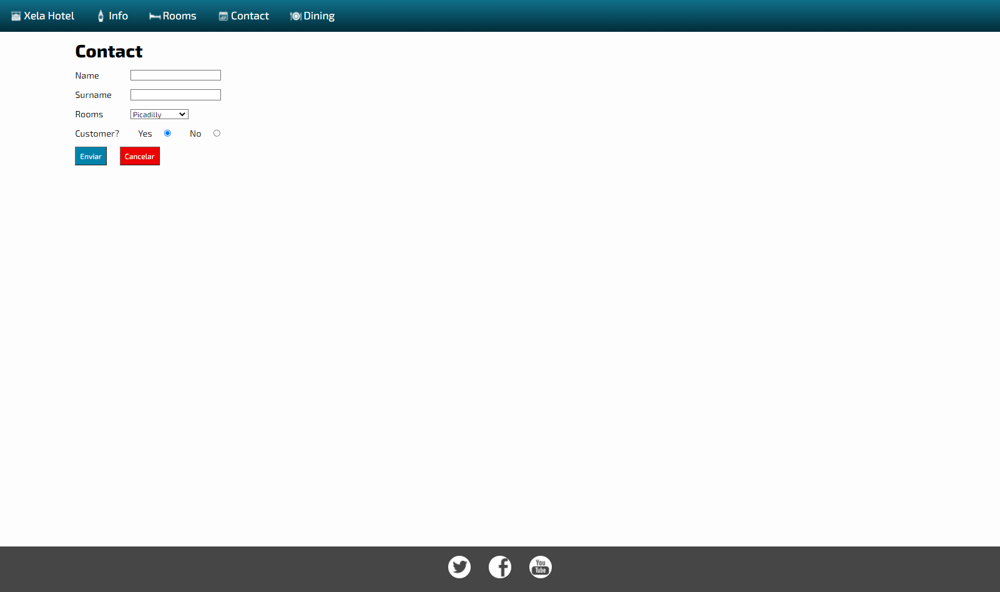

# HTML-CSS Esencial (Práctica 1)

## Github Pages:

Enlace:
[Github-Pages ]()

## Capturas de Pantalla:

### Home:

### Info page:

### Rooms: 

### Contact: 

### Dinning:

### Dificultades:
- Familiarizarme con la Metodología BEM
- Acomodar las imagenes de la sección welcome.

Solo presenté esas dificultades a la hora de realizar la práctica.

### Validación de Código: